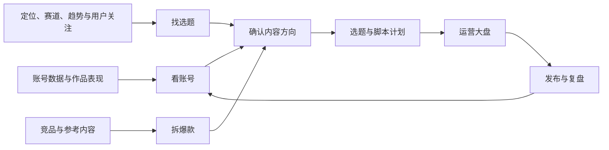
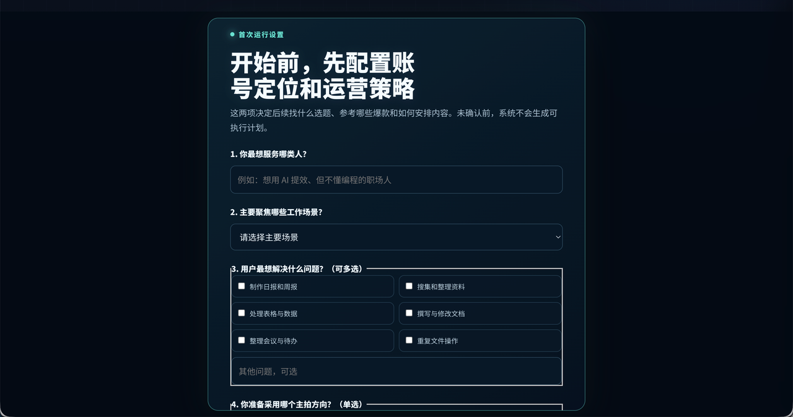

# Short Video Ops

把短视频账号策略、运营数据、选题机会、竞品参考和发布反馈，整理成每天能直接执行的内容计划。

它不是“自动做爆款”的工具，而是一套可复用的运营工作流，帮你回答四个问题：

```text
账号现在怎么样？-> 用户在关心什么？-> 哪些内容值得参考？-> 下一条该做什么？
```

核心工作流、页面模板和 Skill 都在本仓库；真实账号数据、评论、私信和密钥始终放在你本地的独立工作区。

> **这是给 Codex 运行的项目。** Codex 负责读取资料、分析账号、执行工作流和更新数据；Python 脚本负责校验、整理和渲染页面。没有 Codex 也能手动填写 JSON 后生成 HTML，但无法完成“查看账号数据 -> 分析 -> 给出动作”的完整体验。

[查看项目介绍（飞书）](https://tyzwvof1d8.feishu.cn/wiki/MAeFw2ByniVD9KkUKjrcIAI4nFh)

## 你会得到什么

- **运营大盘页面模板**：集中展示账号状态、选题机会、参考内容、候选题和今天的动作。
- **16 个工作流契约**：从看账号、找选题、拆爆款，到计划、脚本、页面回流和发布复盘。
- **5 个公开 Skill**：包括总编排、数据语义边界，以及选题、爆款参考和文案三个业务能力。
- **初始化与校验脚本**：每个账号使用独立工作区，避免数据混在代码仓库里。

## 架构



| 环节 | 你会得到什么 |
| --- | --- |
| 看账号 | 账号现状、表现信号和需要优先解决的问题 |
| 找选题 | 在账号方向内，从用户关注、搜索趋势、行业热点和内容缺口中找可拍题目 |
| 拆爆款 | 可学习的开头、结构、证明方式和行动引导 |
| 出动作 | 今天该做的选题、脚本方向和发布后要看的数据 |

更详细的区域说明见 [运营大盘使用说明](docs/ops-dashboard-guide.md)。

## 依赖

- **Codex Desktop 或 Codex CLI**：负责运行工作流、读取资料和生成运营判断。
- **Python 3.10+**：负责校验工作区和生成运营大盘页面。
- **可选：TikHub Key**：只在下载或研究抖音参考内容时需要。

## 安装与首次运行

### 1. 下载项目

```bash
git clone https://github.com/whwhw/short-video-ops.git
cd short-video-ops
```

### 2. 安装依赖

建议使用 Python 3.10 或更高版本。

```bash
python3 -m venv .venv
source .venv/bin/activate
python3 -m pip install -r requirements-dev.txt
```

### 3. 创建自己的工作区

工作区存放你的账号资料与生成结果，不会被提交到 GitHub。

```bash
python3 scripts/create_workspace.py ~/short-video-ops-data/my-account
```

创建完成后，首次配置页面会自动生成在 `presentation/internal-pages/运营大盘.html`。直接打开页面填写问卷即可，不需要先手工编辑 JSON。

如果你为客户交付，使用更严格的商用模式：

```bash
python3 scripts/create_workspace.py ~/short-video-ops-data/client-a --mode commercial
```

### 4. 先确认账号定位和运营策略

第一次运行前，先让 Codex 检查账号定位与运营策略。两者任一缺失、仍是模板示例或尚未由你确认时，工作流应先向你提问，不能直接找选题、拆爆款或生成可执行计划。

首次生成的运营大盘会显示一份通用配置问卷，适用于知识、职场、商业、电商、美食、美妆、健康、母婴、宠物、旅行、本地生活等不同赛道。问卷先收集账号阶段、赛道、创作者身份、目标用户、真实资源、商业目标、内容形式与长期规划，再按赛道动态显示常见需求。系统会生成三套内容方向供你选择，并整理“账号定位 + 阶段策略 + 30／60／90 天规划”草案；复制给 Codex 复核并经你确认后，才写入正式配置。问卷只保存在当前浏览器本地，不会自动上传或绕过确认。



```text
请先检查工作区 ~/short-video-ops-data/my-account 的 config/profile/ 和 config/strategy/strategy-brief.json。
如果账号定位或运营策略缺失、仍是模板示例或尚未确认，请至少确认：账号阶段、主赛道、创作者身份、目标用户、核心需求、真实资源、阶段目标、商业承接、内容形式和未来规划。请根据事实提供多个内容方向方案，不要预设为 AI 或其他特定赛道。
请把理解总结给我确认；在我确认前，不要找选题、拆爆款、写文案或生成 ready 计划。
```

确认后，将定位写入 `config/profile/`，将稳定的中短期策略写入 `config/strategy/strategy-brief.json`，并保留确认状态和来源。不要根据旧选题、热门视频或页面标题反推账号策略。

### 5. 安装 Skills

把仓库内的五个通用 Skill 复制到 Codex Skill 目录：

```bash
mkdir -p ~/.codex/skills
cp -R skills/short-video-ops ~/.codex/skills/
cp -R skills/short-video-ops-semantic-layer ~/.codex/skills/
cp -R skills/short-video-topic-discovery ~/.codex/skills/
cp -R skills/short-video-benchmark-mining ~/.codex/skills/
cp -R skills/short-video-copywriting ~/.codex/skills/
```

### 6. 用 Codex 跑第一次运营大盘

用 Codex 打开这个项目，或在 Codex CLI 中进入项目目录。然后把下面这段话发给 Codex，并替换工作区路径：

```text
请阅读 AGENTS.md，使用工作区 ~/short-video-ops-data/my-account 更新今天的运营大盘。
先检查账号定位和运营策略是否完整且已经由我确认；如果没有，请先向我提问并等待确认。
确认后再检查有哪些账号数据和选题信号；不要编造缺失数据。
完成后告诉我：最重要的一个信号、今天最值得做的内容动作，以及还缺什么数据。
```

Codex 会根据你提供的资料更新工作区，并调用下面的脚本生成页面：

```bash
python3 scripts/validate_workspace.py ~/short-video-ops-data/my-account
python3 scripts/update_ops_dashboard.py ~/short-video-ops-data/my-account
```

生成后的页面在：

```text
~/short-video-ops-data/my-account/presentation/internal-pages/运营大盘.html
```

双击即可在浏览器中打开。更完整的带做步骤见 [10 分钟跑出第一份运营大盘](docs/quick-start.md)，也可以直接复制 [每日更新大盘提示词](prompts/daily-dashboard.md)。

页面左侧的“账号策略”用于查看当前已确认的账号定位、阶段策略、内容支柱、选题原则和待验证假设。需要调整时，在页面中写下修改意图并复制给 Codex；Codex 会先区分稳定定位与阶段策略、说明影响并请求确认，确认后才更新正式配置。页面本身不会直接覆盖策略文件，避免展示层反向污染事实和策略层。

左侧“素材库”会打开当前工作区的 `data/` 目录。它始终根据本次生成页面所属的工作区计算路径，不绑定开发者电脑或固定账号。

## Skills 与配置

公开版总共包含 5 个 Skill：

| Skill | 职责 | 主要配置 |
| --- | --- | --- |
| `short-video-ops` | 编排看账号、找选题、拆爆款、做计划、更新并校验页面、发布回流 | 工作区 `project.manifest.json`、`data.contract.json`、`workspace.policy.json` |
| `short-video-ops-semantic-layer` | 判断数据属于策略、运营、选题证据、爆款参考、计划或展示层，防止跨层污染 | `workspace.index.json`、数据契约和工作流 manifest |
| `short-video-topic-discovery` | 评估当前方向，构建 60% 保守 / 40% 激进候选池，并选择 2+1 日更组合 | 账号定位、已确认策略、选题发现/选择政策、运营数据、选题信号 |
| `short-video-benchmark-mining` | 围绕已选题查找并拆解 Hook、结构、证明、节奏和 CTA | 已选题、爆款筛选政策、参考库和可访问内容源 |
| `short-video-copywriting` | 把选题、参考结构、真实证明和运营约束转成可拍口播稿 | 选题、逐题拆解、账号口吻、证明素材、目标时长和 CTA |

新工作区至少需要补充以下内容；模板文件会标出字段：

- `config/profile/`：账号定位、目标用户、主赛道、可证明经历和产品/服务。
- `config/strategy/strategy-brief.json`：已确认的中短期方向、选题原则、排除项和阶段目标。
- `config/policies/`：选题发现、候选选择、爆款参考筛选规则。默认规则可直接使用。
- `data/operations/`：平台导出或手工整理的作品表现；缺失时系统应明确阻塞或降低置信度。
- `data/topic-research/`：带来源、日期和证据角色的选题信号；不能用爆款视频替代用户侧证据。

看账号、做计划和更新页面主要属于固定工作流节点；找选题、找爆款和写文案同时提供可复用 Skill。所有节点的输入、输出、依赖和禁止行为仍由 `manifests/` 与 `schemas/` 约束。Codex 本身不需要 OpenAI API Key；只有下载或研究抖音参考内容时才需要可选的 `TIKHUB_API_KEY`。

## 可选：研究抖音参考内容

下载或研究抖音参考内容时才需要 TikHub。把密钥放在项目外的私有文件，例如 `~/.config/short-video-ops/.env`：

```env
TIKHUB_API_KEY=你的密钥
TIKHUB_BASE_URL=https://api.tikhub.io
```

然后运行：

```bash
python3 scripts/download_single_douyin_reference.py \
  ~/short-video-ops-data/my-account \
  "https://v.douyin.com/你的链接/" \
  --env-file ~/.config/short-video-ops/.env
```

请遵守平台条款：只学习内容结构，不复制别人的原文、画面或案例。

## 目录结构

```text
docs/        安装、运营大盘和发布说明
skills/      可公开复用的运营 Skill
templates/   运营大盘和个人工作区模板
prompts/     可直接复制给 Codex 的任务提示词
scripts/     初始化、校验、生成页面和参考研究脚本
workflows/   每一步工作流的可读说明
manifests/   给 Agent 使用的输入、输出和依赖契约
schemas/     数据结构校验规则
```

## 数据与隐私

本仓库只放通用工作流和模板。以下内容请只保存在本地工作区，不要上传：

- 创作者平台导出、评论、私信、客户资料和未公开素材。
- API Key、Cookie、账号密码。
- 内部复盘、个人 Skill 原文和每次运行的真实结果。

发布前可运行：

```bash
python3 scripts/audit_public_release.py
```

它会检查工作流契约、模板私有信息和离线生成流程。完整发布前检查见 [GitHub 发布检查清单](docs/github-release-checklist.md)。

## 许可证

本项目使用 [Apache-2.0](LICENSE)。允许商用、修改和二次分发；分发修改版本时请保留许可证、版权与 [NOTICE](NOTICE)。

## 相关文档

- [快速开始](docs/quick-start.md)
- [运营大盘使用说明](docs/ops-dashboard-guide.md)
- [工作流总览](workflows/README.md)
- [公开 Skills](skills/README.md)
- [架构与数据流](docs/architecture.md)
