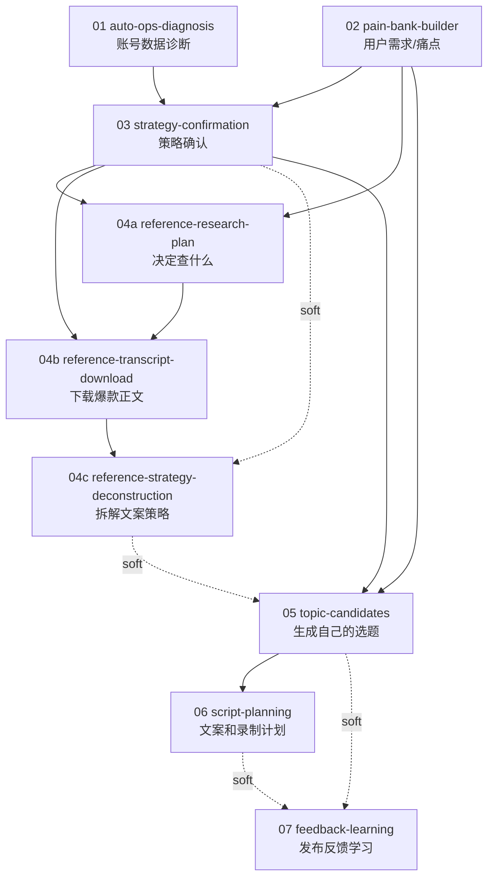

# 工作流解耦与依赖图

## 核心原则

工作流要解耦，但不是无依赖。

正确关系是：

```text
下游工作流依赖上游产物，不依赖上游脚本。
```

也就是说，`分析文案` 不应该调用 `下载视频`，它只读取某次下载生成的 `reference-transcript-collection.json`。如果这个产物不存在，就输出缺失报告，而不是擅自去下载。

## 依赖类型

| 类型 | 含义 | 例子 |
| --- | --- | --- |
| hard | 缺少就不要继续跑 | 04c 必须有 04b 的正文集合 |
| soft | 缺少也能跑，但质量下降 | 05 没有最新 04c，也可以用 reference-bank |

## 当前 DAG



## 对应你的业务流程

```text
先确定账号选题、阶段性方向
  -> 03 strategy-confirmation

分析需要查哪些内容
  -> 04a reference-research-plan

下载对应爆款
  -> 04b reference-transcript-download

分析提炼
  -> 04c reference-strategy-deconstruction

最后分析我有哪些选题
  -> 05 topic-candidates
```

## 每个工作流的边界

| 工作流 | 只做什么 | 不做什么 |
| --- | --- | --- |
| 03 | 确认账号阶段策略 | 不抓爆款、不写选题 |
| 04a | 判断查什么、去哪查、用什么关键词 | 不下载、不拆文案 |
| 04b | 查视频、下载视频、抽音频、转正文 | 不判断策略、不生成选题 |
| 04c | 拆钩子、结构、证明、CTA、可迁移策略 | 不下载视频、不更新 reference-bank |
| 05 | 生成自己的选题池 | 不抓视频、不抄正文 |
| 06 | 写文案和录制计划 | 不修改账号策略 |

## 已安排里的运行建议

当前自动化规则见 `automation-business-logic.md`。原则是：

1. 数据维护类任务可以常驻自动跑。
2. 爆款素材库更新可以作为总工作流自动跑，内部顺序调度 04a/04b/04c/04。
3. 选题、脚本、账号方向默认手动触发。
4. 任务开始前检查 `upstream_dependencies`。
5. hard 依赖缺失时，直接输出 blocked report，说明缺哪个产物。
6. soft 依赖缺失时继续跑，但在输出里标注置信度下降。

## 两种运行模式

### 独立节点模式

适合单独调试：

```text
04a 只产出 research plan
04b 只消费 research plan 并产出 transcript collection
04c 只消费 transcript collection 并产出 strategy deconstruction
05 消费 strategy / pain / references 并产出 topics
```

### 总编排模式

适合爆款素材库自动化或手动一键跑完整链路：

```text
update_reference_materials
  -> 检查 03/02 是否存在
  -> 跑 04a
  -> 跑 04b
  -> 跑 04c
  -> 跑 04 Reference Mining
```

总编排脚本可以调度多个节点，但单个节点本身仍然保持职责单一。

### 手动内容生产模式

适合准备具体视频时：

```text
manual_topic_planning
  -> 读取 strategy-brief / pain-bank / reference-bank
  -> 可选读取最新 reference-strategy-deconstruction
  -> 跑 05 生成候选选题
  -> 用户选择 topic
  -> 跑 06 生成脚本和录制计划
```

选题和脚本不作为常驻自动化，避免在没有明确拍摄意图时自动覆盖正式内容资产。
